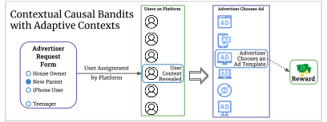

# Causal Contextual Bandits with Adaptive Contexts

## Introduction

This repository contains the implementation of our research on causal contextual bandits with adaptive contexts. Our
work introduces a novel approach to reducing the bandit problem to a convex minimization problem, providing significant
improvements in algorithmic efficiency and effectiveness as shown
by our [experimental results](https://github.com/adaptiveContextualCausalBandits/aCCB/tree/main/outputs/plots).

## Features

We study an algorithm to minimize regret in the causal contextual bandit setting. Here we consider bandits whose
contexts can only be reached stochastically.

- Implementation of a convex minimization approach to causal contextual bandit problems with adaptive context.
- Experiments comparing various exploration strategies, including uniform exploration (UE), UCB-based, and Thompson
  Sampling-based approaches.
- Analysis of the performance across different exploration budgets and contexts.

## Motivating Example

Consider an advertiser looking to post ads on a web-page, say Amazon. They may make requests for a certain type of user
demographic to Amazon. Based on this initial request, the platform may actually choose one particular user to show the
ad to. At this time, certain details about the user are revealed to the advertiser. For example, the platform may reveal
some user demographics, as well as certain details about their device. Based on these details, the advertiser may
choose one particular ad to show the user. In case the user clicks the ad, the advertiser receives a reward. The goal of
the learner is to find optimal choices for initial user preference, as well as ad-content such that user clicks are
maximized. We illustrate this example through the advertiser-motivation Figure below where we indicate the choices
available for template and content interventions.



## Getting Started

### Prerequisites

- Python 3.x
- Other requirements
  in [requirements.txt](https://github.com/adaptiveContextualCausalBandits/aCCB/blob/main/requirements.txt).

### Installation

Clone the repository to your local machine:

```bash
git clone https://github.com/adaptiveContextualCausalBandits/aCCB.git
```

Install the required dependencies:

```bash
pip install -r requirements.txt
```

### Running the Experiments

To run the experiments, use the following command:

```bash
python run_plotters.py
```

## Results

Our experiments demonstrate the efficacy of the convex minimization approach, particularly in comparison to traditional
bandit algorithms. The results are detailed in the following plots:

- [Variation of Expected Regret with Exploration Budget](https://drive.google.com/file/d/1qWSt7Kv-sEi85dD4sjflLnQqRC7V_TCN/view?usp=sharing)
- [Additional Experiments](https://drive.google.com/drive/folders/1VMkeenDM797NtsR25_Fnsc3t3yZkuqy1?usp=sharing)

## Contributing

We welcome contributions from the community. If you would like to contribute, please fork the repository and submit a
pull request.

## License

This project is licensed under the MIT License - see
the [LICENSE](https://github.com/adaptiveContextualCausalBandits/aCCB/blob/main/LICENSE) file for details.

