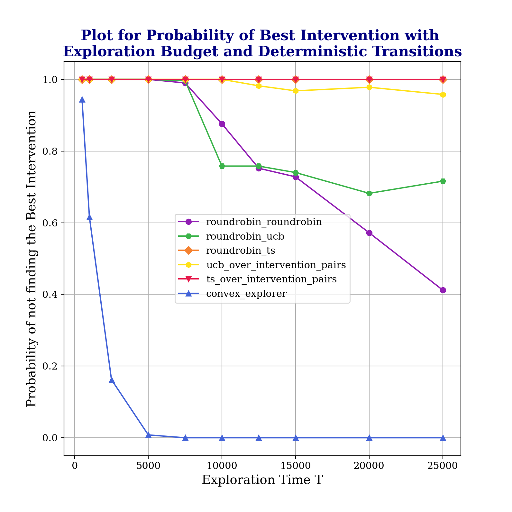
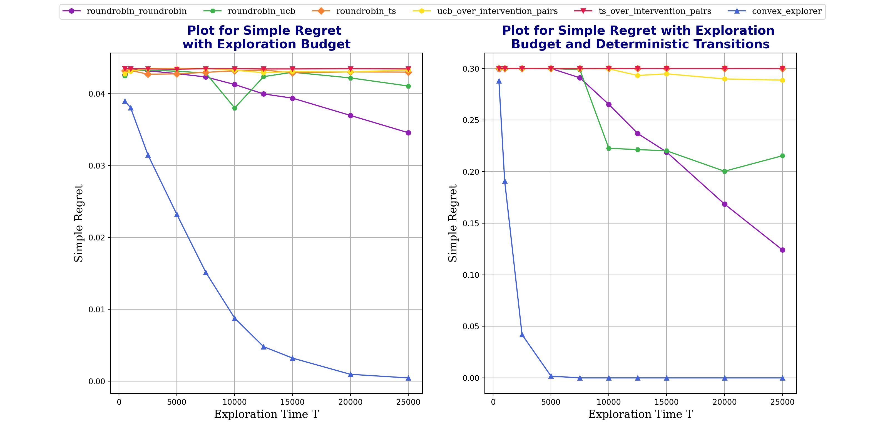
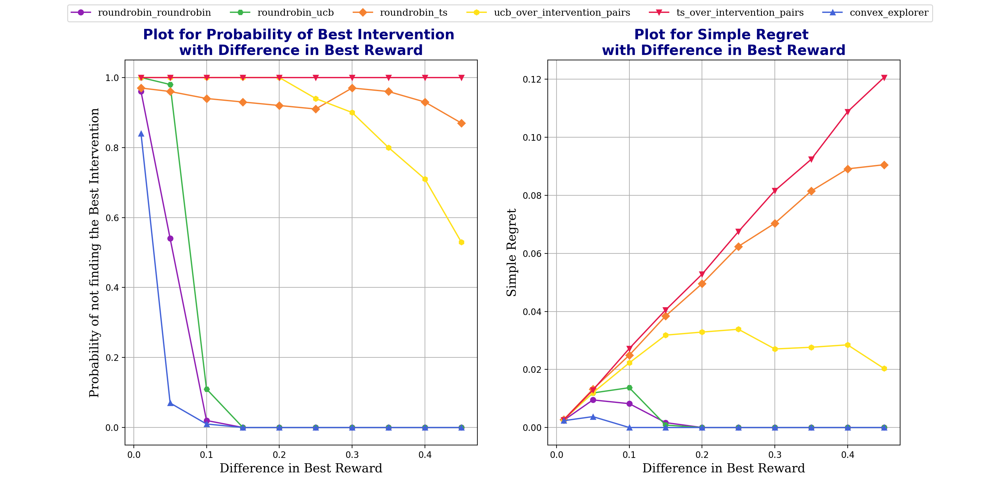
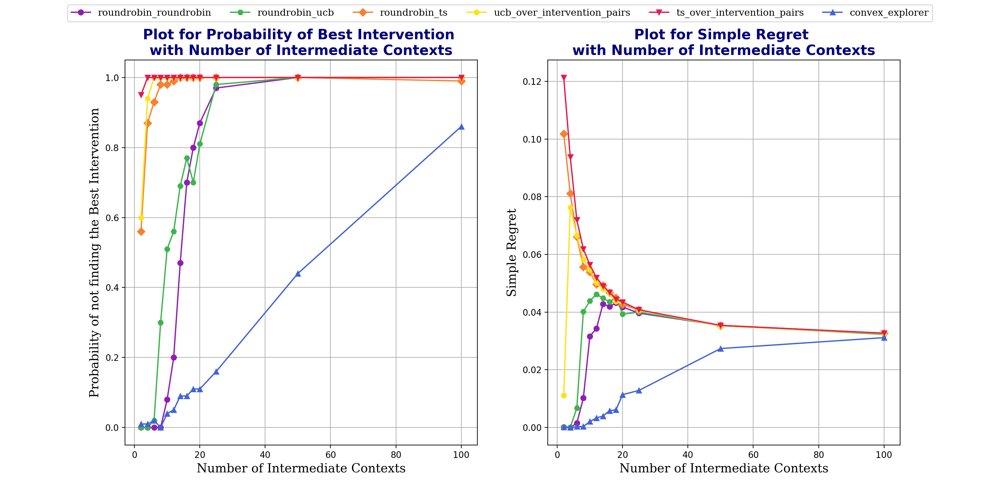
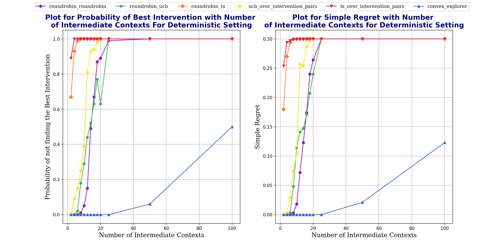

# Causal Contextual Bandits with Adaptive Contexts

## Introduction

This repository contains the implementation of our research on causal contextual bandits with adaptive contexts. Our
work introduces a novel approach to reducing the bandit problem to a convex minimization problem, providing significant
improvements in algorithmic efficiency and effectiveness as shown
by our [experimental results](https://github.com/adaptiveContextualCausalBandits/aCCB/tree/main/outputs/plots).

## Features

We study an algorithm to minimize regret in the causal contextual bandit setting. Here we consider bandits whose
contexts can be reached stochastically by interventions at a start state.

- Implementation of a convex minimization approach to causal contextual bandit problems with adaptive context.
- Experiments comparing various exploration strategies, including uniform exploration (UE), UCB-based, and Thompson
  Sampling-based approaches.
- Analysis of the performance across different exploration budgets and contexts.

## Motivating Example

Consider an advertiser looking to post ads on a web-page, say Amazon. They may make requests for a certain type of user
demographic to Amazon. Based on this initial request, the platform may actually choose one particular user to show the
ad to. At this time, certain details about the user are revealed to the advertiser. For example, the platform may reveal
some user demographics, as well as certain details about their device. Based on these details, the advertiser may
choose one particular ad to show the user. In case the user clicks the ad, the advertiser receives a reward. The goal of
the learner is to find optimal choices for initial user preference, as well as ad-content such that user clicks are
maximized. We illustrate this example through the advertiser-motivation figure below where we indicate the choices
available for template and content interventions.


## Results

Our experiments demonstrate the efficacy of the convex minimization approach, particularly in comparison to traditional
bandit algorithms. The results are detailed in the following plots:

### Plot for Simple Regret with Lambda Value
First we plot the simple regret with lambda, which is the instance dependent causal parameter given the 
problem instance. 


We note that the simple regret is much lower for our Algorithm Convex Explorer than all other comparable methods.

### Plot for Simple Regret with number of Intermediate Contexts

We then plot the simple regret with number of intermediate contexts.


We find that as the number of contexts goes up, the simple regret for all the methods
comes down. This is because of the stochastic transitions. Since the maximum expected regret
for each intervention (that is not the best intervention) comes down, we find that
the simple regret for all the methods falls with number of intermediate contexts when we have approximately uniform
stochastic transitions to the intermediate contexts.

### Plot for probability of not finding the best intervention with exploration budget

We now plot the probability of best intervention with amount of time spent exploring. Note that here, we consider
deterministic transitions to the intermediate contexts. i.e. On choosing an intervention at the start state, one may
deterministically transition to one of the intermediate states.


As expected, our Algorithm performs better than other comparable Algorithms.

### Plot for Simple Regret with Exploration Budget for Stochastic and Deterministic Transitions

Now to show that the deterministic setting is much easier than the stochastic setting (for any algorithm), we
plot the simple regret in both these settings below.


Note the faster convergence for the deterministic setting than for the stochastic setting. This is most ostensibly seen for the Convex Explorer Algorithm,
but also noticeable for the other algorithms.

### Plot for Simple Regret and probability of not finding the best intervention with difference in best reward

We highlight that the simple regret metric is distinct from the probability of best intervention
through the following figure. The difference in best reward is the reward difference
between the best intervention, and other interventions in the problem setup. The higher
this number is, the easier an algorithm should find it to discover the best intervention.



Notice that as the difference in best reward increases, the simple regret first
increases and then decreases. The point of increase and decrease is different
for different algorithms. We note that as the difference between the best intervention
and other interventions increases, the probability of the algorithm not returning
the best intervention decreases. On the other hand, the simple regret may first increase
as the regret is the probability of a mistake times the expected cost of the mistake (difference in best intervention).

### Plot for Simple Regret and probability of not finding the best intervention with Number of Intermediate Contexts

Finally, we would like to show the difference between the plots for probability of not finding the best intervention 
and the simple regret with number of intermediate contexts.



We note that as the number of intermediate contexts increases, we have a harder problem,
and hence the probability of not finding the best intervention only increases. This is because
we split the budget available amongst more intermediate contexts. Therefore, it is fairly straightforward to see that
with a constant budget, we will end up with lower probabilities of finding the best intervention, when the number
of intermediate contexts increase. On the other hand, in the figure on the right, we
can see that as the number of intermediate contexts increase, the cost of not finding the best
intervention, in expectation, decreases. This is because, even the best intervention at the start state, has a lower
probability of reaching the intermediate context which contains the best reward. 

We note that such a phenomenon does not arise in the case of deterministic transitions, as seen in the plot below.




While this section highlights some of our important experiments, we carried out many
more experiments, which we delineate in the following subsection.


## Additional Plots

We have compiled additional plots in the folders below:

- [Basic Plots](https://drive.google.com/drive/folders/1VMkeenDM797NtsR25_Fnsc3t3yZkuqy1?usp=sharing)
- [Additional Plots](outputs/plots/)


## Getting Started with the Code

### Prerequisites

- Python 3.x
- Other requirements
  in [requirements.txt](https://github.com/adaptiveContextualCausalBandits/aCCB/blob/main/requirements.txt).

### Initial Setup

Clone the repository to your local machine:

```bash
git clone https://github.com/adaptiveContextualCausalBandits/aCCB.git
```

Check into the required directory and create a local environment
```bash
cd aCCB
# create a virtual environment
python -m venv venv

# activate the virtual environment
source venv/Scripts/activate
```

Install the required dependencies in the virtual environment:
```bash
pip install -r requirements.txt
```
NOTE: Since python version 3.12 does not come with setuptools pre-installed, additional setup may be required for the 
cvxpy package. Suggested to go for earlier versions of python.

### Running the Experiments

To run the experiments, use the following command:

```bash
python runAllExperiments.py
```

The above step may take a few hours depending on the speed of your machine. If you instead want to run the experiments 
in parallel, you may instead run the following four commands on four separate terminals.

```bash
python runAllWithDiffInBestReward.py
python runAllWithExplorationBudget.py
python runAllWithExplorationBudgetLongHorizon.py
python runAllWithLambda.py
python runAllWithNumIntermediateContexts.py
```

The above may be approximately five times faster due to parallelism (given sufficient compute threads).


### Plot the results of the experiments

```bash
python run_plotters.py
```

The results should now be available in the `outputs/` folder as tables and the plots for these 
would be available in the `outputs/plots/` folder.


## Contributing

We welcome contributions from the community. If you would like to contribute, please fork the repository and submit a
pull request.


## License

This project is licensed under the MIT License - see
the [LICENSE](https://github.com/adaptiveContextualCausalBandits/aCCB/blob/main/LICENSE) file for details.

